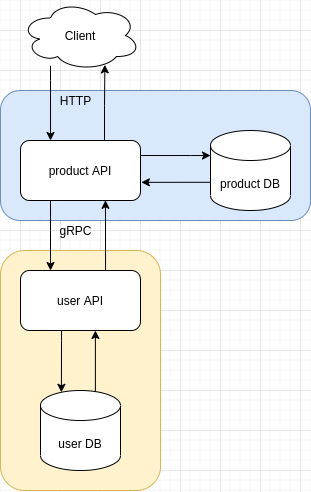

# Hash Code Challenge 

[](https://github.com/fellipe-pinheiro/hash_challenge/actions)  
[](https://github.com/fellipe-pinheiro/hash_challenge/actions/workflows/apps-cd.yml)


[Hash backend challenge project](https://github.com/hashlab/hiring/blob/master/challenges/pt-br/back-challenge.md)

## Architecture
[Product API](./product_api/)  
[User API](./user_api/)  



## Application Checklist
- [x] [Apps] CI (https://github.com/fellipe-pinheiro/hash_challenge/actions/workflows/apps-ci.yml)
- [x] [Product API] Swagger (http://petstore.swagger.io/?url=https://raw.githubusercontent.com/fellipe-pinheiro/hash_challenge/main/.docs/swagger.json)
- [x] [Product API] Metrics (http://localhost:8080/metrics)

 ### Premissas da leitura do que foi pedido da descrição do teste  
 
 **como não tenho como tirar dúvidas sobre produto e com outros devs eu assumi essas premissas**

> Se o serviço de desconto (1) cair, o serviço de lista (2) tem que continuar funcionando e retornando a lista normalmente, só não vai aplicar os descontos.  

> Caso o serviço 1 retorne um erro, a lista de produtos ainda precisa ser retornada, porém com esse produto que deu erro sem desconto.

Para que isso funcione a base de dados precisa estar na Product API, logo não faz sentido a User API ter acesso a base de productos

> Este serviço recebe um id de produto e um id de usuário e retorna um desconto.

Como a User API não precisa ter acesso ao banco não faz sentido receber o id do produto  
Na subida do banco já coloquei seeds para persistir os descontos padrão, produtos e usuários

> Considere que as regras de descontos irão mudar com o tempo

Essas regras precisam estar persistidas no banco de dados para que o CRUD possa ser utilizado, através de uma intranet, pela equipe de produtos 

> product -> price_in_cents: int  

Esse campo deve ser o valor total do produto sem desconto em qual caso  
Caso tenha desconto será subtraído no front para usuário ver o valor total, desconto e o que foi economizado  

> demais pontos  

Na Product API coloquei pra pegar o id do usuário pega query string também para facilitar os testes

Protobuf está no mesmo repo do projeto, mas creio que deveria estar num separado somente para os protos da empresa

Paginação começar em 0

Usei como CI o CircleCI  

Usei como CD o Jenkins


### dados iniciais do sistema

**products**
|id|title|description|price_in_cents|created_at|updated_at|
|--|-----|-----------|--------------|----------|----------|
|1|keyboard||20000|2021-02-25 23:55:26|2021-02-25 23:55:26|
|2|mouse||3000|2021-02-25 23:55:26|2021-02-25 23:55:26|
|3|smartphone||200000|2021-02-25 23:55:26|2021-02-25 23:55:26|
|4|iphone||1000000|2021-02-25 23:55:26|2021-02-25 23:55:26|
|5|headset||15000|2021-02-25 23:55:26|2021-02-25 23:55:26|
|6|notebook||350000|2021-02-25 23:55:26|2021-02-25 23:55:26|
|7|macbook||1500000|2021-02-25 23:55:26|2021-02-25 23:55:26|
|8|tablet||300000|2021-02-25 23:55:26|2021-02-25 23:55:26|
|9|ipad||700000|2021-02-25 23:55:26|2021-02-25 23:55:26|
|10|monitor||70000|2021-02-25 23:55:26|2021-02-25 23:55:26|


**users**
|id|first_name|last_name|date_of_birth|created_at|updated_at|deleted_at|
|--|----------|---------|-------------|----------|----------|----------|
|1|Thor|Odinson|2021-02-28|2021-02-26 02:35:06|2021-02-26 02:35:06||
|2|Loki|Odinson|2021-02-26|2021-02-26 02:35:06|2021-02-26 02:35:06||

**discounts**
|id|name|date|value|created_at|updated_at|deleted_at|
|--|----|----|-----|----------|----------|----------|
|1|blackfriday|2021-11-25|5|2021-02-26 02:35:06|2021-02-26 02:35:06||
|2|burning stock|2021-02-26|10.5|2021-02-26 02:35:06|2021-02-26 02:35:06||
|3|boss is crazy|2021-02-26|8|2021-02-26 02:35:06|2021-02-26 02:35:06||
|4|birthday||10|2021-02-26 02:35:06|2021-02-26 02:35:06||

## how to run

### just one command

execute all steps in just one command 
```sh
cp .env.example .env
make apps/all/run
```

### step by step

create .env to test
```sh
cp .env.example .env
```

install applications dependencies
```sh
make apps/dependencies
```

run database
```sh
make apps/migrations
```

build proto
```sh
make apps/proto
```

run applications
```sh
make apps/run
```

## how to test

create .env to test
```sh
cp .env.example .env
```

run apps test coverage 
```sh
make apps/cov
```

## how to deploy

create new [github release](https://github.com/fellipe-pinheiro/hash_challenge/releases) to start CD workflow

### application links

- Listar produtos  
http://localhost:8080/v1/product

- Listar produtos passando um usuário
http://localhost:8080/v1/product?user-id=2

- Listar produtos da segunda pagina
http://localhost:8080/v1/product?user-id=2&page=1

- Listar 5 produtos da segunda pagina
http://localhost:8080/v1/product?user-id=2&page=1&size=5

## references
- https://grpc.io/
- [Proto with NodeJs](https://github.com/grpc/grpc/tree/master/examples/node/static_codegen)
- [Proto with Python](https://github.com/grpc/grpc/tree/master/examples/python)